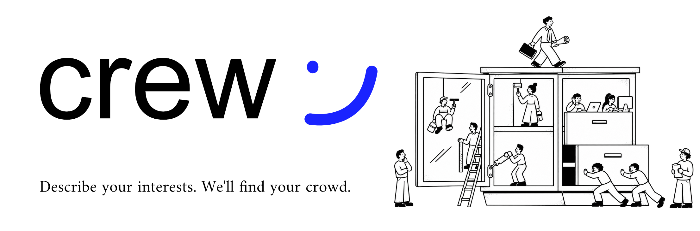

<p align="center">
    <code>Describe your interests. We'll find your crowd.</code>
    <br />
    <br />
    <a href="https://github.com/praveen-tek/crew/issues">Issues</a>
    ·
    <a href="#demo">Demo</a>
    ·
    <a href="#">Changelog</a>
</p>

## About Crew

Crew is a matchmaking tool built for Aatmoday. Students often don't know which sub-group, hobby community, or event fits them — especially new students trying to find people to talk to. Describe your interests in a sentence, and Crew finds the most relevant Aatmoday groups or events, explains why each one is a good match, and writes a personalized icebreaker so you have something to say when you show up.

## Hackathon Info

- **Event:** Code Vidya Hack Day
- **Problem Statement:** PS 5 — Hobby Matchmaker for Aatmoday
- **Team Members:** [add names]

## Problem

Students have interests and hobbies but don't know which Aatmoday sub-group, community, or event fits them. This is especially hard for new students trying to discover relevant groups and start a conversation.

## Solution

A single input where a student describes their interests in free text. The system matches that against a database of Aatmoday groups/events, returns the top matches with a short reason each, and generates a personalized icebreaker message per match.

## Get Started

**Using Crew?**
→ Sign in with Google and describe what you're into.

**Want to run it locally?**
→ See [Installation](#installation) below.

## Features

- [ ] Free-form interest input
- [ ] Aatmoday group/event database
- [ ] AI-based interest matching
- [ ] Top group/event recommendations with reasoning
- [ ] Personalized icebreaker generation
- [ ] Support for multiple/mixed interests in one query

## Tech Stack

- **Frontend:** Next.js 16, React 19, Tailwind CSS 4
- **Backend:** Next.js route handlers + server actions, `proxy.ts` for auth-gated routing
- **Auth:** Better Auth (Google OAuth only)
- **Database:** PostgreSQL on Neon
- **ORM:** Drizzle ORM + drizzle-kit
- **AI Model/API:** Gemini API
- **Monorepo:** Turborepo + pnpm workspaces

## How It Works

1. User signs in with Google and enters a free-text description of their interests.
2. The backend sends the interest and the full groups/events list to Gemini.
3. Gemini returns the top matches, a short reason for each, and a personalized icebreaker.
4. Results are stored in Postgres and render as cards in the UI.

## Subprocessors

Crew relies on the following third-party services to operate:

| Subprocessor | Purpose |
|---|---|
| Google (Gemini API) | AI-based interest matching, reasoning, and icebreaker generation |
| Google (OAuth) | Authentication via Better Auth (name, email, avatar) |
| Neon | Managed PostgreSQL hosting for all application data |

## Installation

```bash
git clone https://github.com/praveen-tek/crew.git
cd crew
pnpm install
```

Add your environment variables to `apps/web/.env`:


Push the schema to your Neon database:

```bash
pnpm --filter web drizzle-kit push
```

## Running the Project

```bash
pnpm dev
```

Visit `http://localhost:3000`.

## Demo

[Will be added once completed]

## Status

`Built for Code Vidya Hack Day. Status[🟡 Under Development]`